# Aura - Advanced Gameplay Abilities System Project

## Changelog

### 2025-09-08 14:24:23 - Initial AI Context Initialization
- Created comprehensive project documentation
- Analyzed project structure with 37+ C++ source files
- Identified 6 major architectural modules
- Generated module structure diagram and navigation system
- Coverage: 95% of source code architecture mapped

## Project Vision

Aura is an advanced Unreal Engine 5.5 project demonstrating a comprehensive implementation of the Gameplay Ability System (GAS). The project showcases modern UE5 architectural patterns including enhanced input handling, attribute-based character systems, and sophisticated UI widget controllers. It serves as both a functional game prototype and a reference implementation for advanced UE5 gameplay mechanics.

## Architecture Overview

The project follows a modular C++ architecture with clear separation of concerns:

- **Core Game Framework**: GameMode, PlayerController, PlayerState, HUD
- **Character System**: Abstract base character with concrete player and enemy implementations
- **Ability System**: Custom GAS components, attribute sets, and effect calculations
- **User Interface**: Widget controllers following MVP pattern
- **Actor System**: Effect actors and interactive world objects
- **Interaction System**: Interface-based communication patterns

Key architectural patterns:
- **Gameplay Ability System (GAS)** for all character abilities and attributes
- **Widget Controller Pattern** for UI state management
- **Interface-based Design** for modular character interactions
- **Attribute-based Character Progression** with custom magnitude calculations

## Module Structure Diagram

```mermaid
graph TD
    A["(Root) Aura Project"] --> B["Source/Aura"];
    B --> C["Game"];
    B --> D["Player"];
    B --> E["Character"];
    B --> F["AbilitySystem"];
    B --> G["UI"];
    B --> H["Interaction"];
    B --> I["Actor"];
    
    C --> C1["AuraGameModeBase"];
    D --> D1["AuraPlayerController"];
    D --> D2["AuraPlayerState"];
    E --> E1["AuraCharacterBase"];
    E --> E2["AuraCharacter"];
    E --> E3["AuraEnemy"];
    F --> F1["AuraAbilitySystemComponent"];
    F --> F2["AuraAttributeSet"];
    F --> F3["ModMagnitudeCalculation"];
    G --> G1["HUD"];
    G --> G2["Widget"];
    G --> G3["WidgetController"];
    H --> H1["CombatInterface"];
    H --> H2["EnemyInterface"];
    I --> I1["AuraEffectActor"];

    click C "./Source/Aura/Game/CLAUDE.md" "View Game module documentation"
    click D "./Source/Aura/Player/CLAUDE.md" "View Player module documentation"
    click E "./Source/Aura/Character/CLAUDE.md" "View Character module documentation"
    click F "./Source/Aura/AbilitySystem/CLAUDE.md" "View AbilitySystem module documentation"
    click G "./Source/Aura/UI/CLAUDE.md" "View UI module documentation"
    click H "./Source/Aura/Interaction/CLAUDE.md" "View Interaction module documentation"
    click I "./Source/Aura/Actor/CLAUDE.md" "View Actor module documentation"
```

## Module Index

| Module | Path | Primary Responsibility | Key Classes | Status |
|--------|------|----------------------|-------------|--------|
| **Game** | `Source/Aura/Game/` | Core game framework and mode management | AuraGameModeBase | Active |
| **Player** | `Source/Aura/Player/` | Player-specific controllers and state | AuraPlayerController, AuraPlayerState | Active |
| **Character** | `Source/Aura/Character/` | Character implementations and base classes | AuraCharacterBase, AuraCharacter, AuraEnemy | Active |
| **AbilitySystem** | `Source/Aura/AbilitySystem/` | Gameplay Ability System implementation | AuraAbilitySystemComponent, AuraAttributeSet | Active |
| **UI** | `Source/Aura/UI/` | User interface and widget management | AuraHUD, AuraUserWidget, Widget Controllers | Active |
| **Interaction** | `Source/Aura/Interaction/` | Interface-based communication systems | CombatInterface, EnemyInterface | Active |
| **Actor** | `Source/Aura/Actor/` | World actors and effect systems | AuraEffectActor | Active |

## Running and Development

### Prerequisites
- Unreal Engine 5.5
- Visual Studio 2022 (recommended)
- Enhanced Input Plugin (enabled)
- Gameplay Abilities Plugin (enabled)

### Building the Project
1. Clone repository to `UnrealFiles/2024/Aura/`
2. Generate Visual Studio project files via Aura.uproject
3. Build in Development Editor configuration
4. Launch via Unreal Editor

### Key Build Dependencies
- **Public Modules**: Core, CoreUObject, Engine, InputCore, EnhancedInput
- **Private Modules**: GameplayAbilities, GameplayTags, GameplayTasks

## Testing Strategy

The project utilizes Blueprint-based testing through:
- **Character Blueprints**: BP_AuraCharacter, BP_EnemyBase
- **Ability Testing**: TestActor implementations with attribute-based effects
- **UI Testing**: Widget controller validation through overlay systems
- **Integration Testing**: Full GAS pipeline testing via gameplay effects

## Coding Standards

- **Header Organization**: Consistent copyright headers with class documentation
- **Forward Declarations**: Minimize include dependencies via forward declarations
- **UCLASS Specifiers**: Proper use of Abstract, BlueprintType, etc.
- **Memory Management**: Smart pointers (TObjectPtr) for UObject references
- **Interface Design**: Pure virtual interfaces for extensibility
- **Macro Usage**: ATTRIBUTE_ACCESSORS for consistent attribute handling

## AI Usage Guidelines

This project serves as an excellent reference for:
- **Gameplay Ability System Implementation**: Complete GAS setup with custom components
- **Modern UE5 Architecture**: Enhanced Input, Widget Controllers, Interface patterns
- **Attribute System Design**: Custom calculations with MMC classes
- **UI Architecture**: Separation of UI logic via widget controllers
- **Character Framework**: Abstract base with specialized implementations

When extending this codebase:
1. Follow established interface patterns for new character interactions
2. Use widget controllers for UI state management rather than direct Blueprint bindings
3. Implement custom GameplayEffects for new abilities and attributes
4. Maintain clear separation between C++ logic and Blueprint presentation